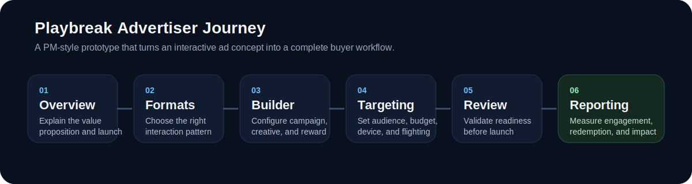
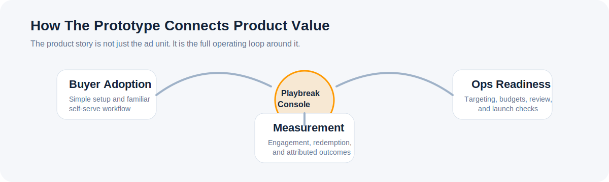

# Fire TV Playbreak Console

A product prototype for an advertiser-facing console that makes interactive Fire TV campaigns easier to plan, launch, and measure.

The focus of this project is the product itself: the buyer problem, the workflow needed to solve it, and the operational and measurement details required to make the idea usable.



## What This Project Is

`firetv-playbreak-console` is a prototype console for a hypothetical Amazon Ads / Fire TV offering called **Playbreak**.

The concept:

- Advertisers can launch lightweight interactive ad moments on Fire TV.
- Campaigns can include formats like quick trivia, multiple-choice prompts, and reward-driven interactions.
- Buyers can move from setup to reporting in one connected flow instead of stitching together separate planning, trafficking, and measurement experiences.

This project simulates that end-to-end product journey through a polished demo UI:

- Overview
- Format selection
- Campaign builder
- Targeting and budget controls
- Review and launch
- Reporting dashboard

## The Problem It Is Solving

Interactive ad formats are powerful, but they are often hard to operationalize.

From a product perspective, the friction usually shows up in a few places:

- The ad format sounds exciting in a pitch, but the buying workflow is unclear.
- Creative setup feels custom and hard to scale.
- Launch dependencies are hidden across multiple teams.
- Measurement is fragmented, making it hard for buyers to connect engagement to business outcomes.

If a buyer or account team cannot understand how a product would actually be bought, configured, approved, and measured, the concept stays stuck as a sales story instead of becoming a usable platform capability.

This prototype addresses that gap by turning an abstract ad concept into a concrete product surface.

## The Product Idea

The console is designed around a simple product promise:

**Make Playbreak campaigns feel as easy to buy and manage as a familiar self-serve advertising workflow.**

To support that, the prototype emphasizes:

- Familiar console patterns for campaign setup
- Fast format selection based on advertiser goals
- Structured creative configuration instead of custom ops-heavy handoffs
- Audience and budget controls that feel realistic for media buyers
- Review and launch checkpoints that reduce ambiguity
- A reporting experience that ties engagement, redemption, and attributed outcomes together



## Product Thinking Behind The Flow

The experience is designed around a few core principles:

- **User clarity:** The flow is organized around what a buyer needs to do next, not around backend system boundaries.
- **Operational realism:** Budgeting, audience targeting, launch readiness, and reporting are included so the concept feels shippable.
- **Commercial thinking:** The prototype references business concepts like CPE pricing, reward redemption, and attributed conversions.
- **Stakeholder alignment:** The screens are useful for product reviews with design, engineering, ads sales, GTM, and leadership.
- **Narrative completeness:** It does not stop at a flashy format demo; it shows the full lifecycle from concept to measurement.

## Core User Journey

### 1. Understand the value proposition

The overview page explains the Playbreak concept, the time-to-launch promise, and the measurement story.

### 2. Choose the right interaction format

Advertisers can select from multiple interactive patterns such as:

- `QuickVoice`
- `SpeedPick`
- `RevealIt`

Each format is presented in terms of use case, strengths, and expected KPI fit.

### 3. Build the campaign

The builder lets users define:

- campaign name
- brand identity
- creative headline
- question and answer options
- reward type and value
- visual styling

This helps make the ad unit feel configurable and repeatable, not bespoke.

### 4. Set delivery controls

Users can then configure:

- audience segments
- geography
- device scope
- flight window
- bid model
- total and daily budgets

This is where the prototype starts to feel like a real console instead of a concept mock.

### 5. Review before launch

The review screen summarizes the entire campaign package and surfaces a launch-readiness checklist.

### 6. Measure outcomes

The reporting dashboard closes the loop with:

- completion rate
- engagement rate
- reward redemption
- attributed conversions
- brand lift style readouts
- segment-level performance

That measurement layer is important because it shows how the product could justify advertiser value after launch, not just before it.

## Who This Prototype Is For

This repo is useful for:

- designers shaping internal tool and console workflows
- engineers scoping what a first version of the platform might require
- GTM and ads stakeholders who need to react to something concrete
- teams exploring interactive ad product concepts

## Tech Stack

- Next.js
- React
- TypeScript

## Running Locally

```bash
npm install
npm run dev
```

Then open `http://localhost:3000`.

## Notes

- This is a prototype, not a production advertising platform.
- The reporting and campaign data are realistic mock data intended for product storytelling and stakeholder review.
- The main value of the repo is the product framing and workflow design, not backend integration depth.
